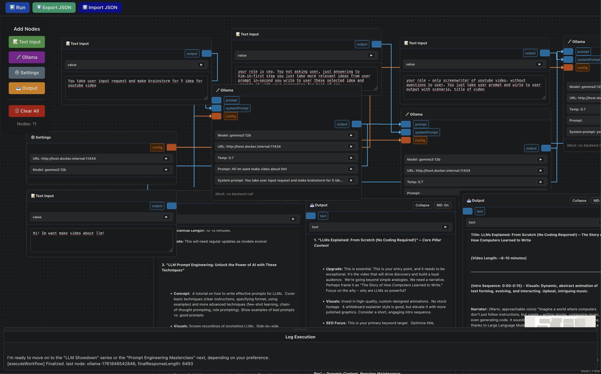

## PipelineLLM

A lightweight visual workflow builder for LLM pipelines. Compose workflows from nodes (Text Input → LLM → Output) and run them locally. Frontend is React + React Flow; backend is Flask with an Ollama proxy endpoint.



### Table of Contents

- [Highlights](#highlights)
- [Quick Start](#quick-start)
  - [Frontend](#frontend)
  - [Backend](#backend)
  - [Docker (frontend + backend + nginx)](#docker-frontend--backend--nginx)
- [Frontend Overview](#frontend-overview)
  - [NodeShell API (shared UI)](#nodeshell-api-shared-ui)
  - [Output Node specifics](#output-node-specifics)
  - [Docs (frontend)](#docs-frontend)
- [Backend Overview](#backend-overview)
  - [Endpoints](#endpoints)
  - [Config](#config)
- [Project Structure](#project-structure)
- [Development Notes](#development-notes)
- [Roadmap (short)](#roadmap-short)

### Highlights

- Node-based canvas with connectors and labels
- Consistent node shell (`NodeShell`) with header, connectors and controls
- Implemented nodes:
    - TextInputNode: emits user text
    - SettingsNode: provides `config` (url, model) to other nodes
    - OllamaNode (mock): displays config/prompt info (no backend call yet)
    - OutputNode: shows rendered text/markdown with autosize/expand
- Backend Flask API with `/api/ollama/chat` proxy and health endpoints
- Docker compose for local full-stack

---

### Quick Start

Prereqs: Node.js 18+, Python 3.9+, (optional) Docker

Frontend

```bash
git clone https://github.com/davy1ex/pipelineLLM
cd frontend
npm install
npm run dev
# http://localhost:5173
```

Backend

```bash
cd backend
pip install -r requirements.txt
python server.py
# http://localhost:5000
```

Docker (frontend + backend + nginx)

```bash
docker compose -f docker/docker-compose.yml up --build
```

---

### Frontend Overview

- Stack: React 18/19, TypeScript, Vite, React Flow
- Entry: `frontend/src/app/main.tsx`, page: `frontend/src/pages/workflow/WorkFlowPage.tsx`
- Canvas feature: `frontend/src/features/canvas`
- Execution (WIP): `frontend/src/features/workflow-execution`
- Nodes: `frontend/src/entities/nodes/*`
    - Text Input: `text-input/TextInputNode.tsx`
    - Settings: `settings/SettingsNode.tsx`
    - Ollama (mock): `ollama/OllamaNode.tsx`
    - Output: `output/OutputNode.tsx`

#### NodeShell API (shared UI)

`frontend/src/shared/ui/NodeShell.tsx`

- Props: `title`, `headerActions?`, `width?`, `controls?`, `connectors?`
- `connectors`: array of `{ id?, type: 'source'|'target', position, label, dataType? }`
- Renders connectors as rows: handle (+ color by data type) + text label
- Controls: compact rows with optional editing and value view

#### Output Node specifics

- Renders plain text or markdown (`markdown-it`)
- Expand button toggles height clamp; autosize computes width/height to fit content
- Long content wraps at ~1200px; horizontal overflow is avoided

Docs (frontend)

- `frontend/docs/ARCHITECTURE.md`
- `frontend/docs/NODES_AND_EDGES.md`
- `frontend/docs/WORKFLOW_STORE.md`

---

### Backend Overview

`backend/server.py` (Flask + CORS)

Endpoints

- `GET /api/health` – basic health
- `GET /api/hello?name=...` – sample
- `POST /api/data` – echo
- `POST /api/ollama/chat` – proxy to Ollama `/api/generate`
    - Body: `{ url?, model?, prompt, system?, temperature? }`
    - Normalizes Ollama URL; maps localhost to `host.docker.internal` for Docker

Config

- Example env: `backend/env.example`
- Run: `python server.py` (port 5000)

---

### Project Structure

```
pipelineLLM/
├── backend/
│   ├── server.py
│   ├── requirements.txt
│   └── Dockerfile
├── docker/
│   ├── docker-compose.yml
│   └── nginx/
├── frontend/
│   ├── src/
│   │   ├── app/
│   │   ├── entities/
│   │   │   └── nodes/
│   │   ├── features/
│   │   ├── pages/
│   │   └── shared/
│   ├── package.json
│   └── vite.config.ts
└── README.md
```

---

### Development Notes

- Connectors are rendered inside `NodeShell` (not via absolute-positioned React Flow handles anymore). Pass connectors as an array on each node component (see `OllamaNode.tsx`, `SettingsNode.tsx`, `TextInputNode.tsx`, `OutputNode.tsx`).
- Handle color is derived from data type via `shared/lib/dataTypes.ts`.
- The canvas store and execution store live under `features/canvas` and `features/workflow-execution`.

---

### Roadmap (short)

- add python block 
- add block for reading file 
- add block to zettelkasten notetaking from ollama block